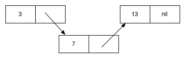

#Common Lisp

###CSCI3055u

####Caleb Phillips 100518555

________________________________

###Introduction

In this paper I will explore the language Common Lisp, a standardized dialect of John McCarthy's original Lisp, which is one of the oldest programming languages still in use today. And the oldest still being actively developed with.


Due to Lisp's unique feature of being able to define itself (i.e. write a compiler) in Lisp, there are many variations of the original language. Common Lisp was an attempt to standardize the language as defined in the ANSI standard document. There are many compilers/interpreters for Common Lisp, and the one in particular I have used for all of the code and testing in this document is CLISP. CLISP follows the standard put forth by the ANSI standard document, and includes a few extra features unique to the compiler.

The CLISP compiler is available at [http://www.clisp.org/](http://www.clisp.org/).

Throughout this document I will provide as many code examples as possible to back up the claims being made about the language. It can be assumed that all of these code examples have been tested, and produce an output similar to that shown in each code block. The code examples are either performed directly in the CLISP REPL, or saved in a .lisp file and loaded into the REPL with the `load` function.

Code examples in this document are generally written as:

```

(some code) ; => Output

```

Comments in Common Lisp are denoted with a `;`, and since the written output is commented out in all of the code, it allows copy and paste execution of any of the examples.

Common Lisp code appears in two basic syntactic forms, atoms or S-expressions. Atoms are single entities or values that can appear without any surrounding brackets. For example, `10` is an atom. S-expressions are the general bracketed expression that is common lisp dialects, and generally appear in the form `(function and some arguments or (other S-expressions))`.

My work in this book attempted to follow some standards used by LISP programmers for writing code. Although these standards are not required, they are worth mentioning as apparently it is social suicide to do otherwise amongst the LISP community. Variables and functions all use lower case letters when being defined and reference, and if they require multiple words, the words are separated by a hyphen. For example:

```

(defun my-function (my-variable) (princ my-variable))

```

One of the main reasons for using the dash as opposed to traditional camelCasing is because of the way Lisp handles it's symbols. When a symbol (which includes, but is not limited to, a variable or function name) is read by the CLISP compiler, it is automatically forced to all capital letters by default for later use or storage. For this reason also symbols are case insensitive, but more on this later.

An additional convention is to denote global variables by surrounding them with asterisks. Again this is not required, but important. Because of the importance that Lisp and the functional paradigm places on pure functions, it is important to know when a function is affecting something outside of it's scope, and is therefore not pure. Pure functions of course meaning that they have no side effects, and only alter data internally.

###Type System

Common Lisp is a strongly, and dynamically typed language. Although it offers some support for type declarations, it is not commonly used. The purpose of type declarations in Common Lisp is to provide extra information to a compiler for optimizations when it may be necessary, although for most of my sample programs, it will not be. Many Common Lisp compilers claim the potential for code that is able to run faster than the C programming language, given that these optimizations are used properly.

There are several data types in Common Lisp, many are familiar in respect to our usual object oriented tools, and some are far more mathematical in nature.

#####Lists

The backbone of any Lisp are it's heterogenous structures known as list's. To understand the underlying implementation and meaning of lists consider the `cons` function.

```

(cons 1 '(2 3 4)) 	; => (1 2 3 4)

```

`cons` joins two lists or values together to create a new list. But why `cons`? What if we just `cons` together two elements, in this case symbols:

```
(cons 'red 'blue) 	; => (RED . BLUE)

```

What is that dot in the middle? The dot represents that this paired piece of data is actually a cons cell. A cons cell is simply a 2 boxed cell each containing a pointer to a piece of data. When we call `cons` on red and blue, we create a cons cell with the the first pointer pointing to our symbol 'red', and the second to 'blue'.

So why does this allow us to join 2 lists together? Simply because we are able to have each pointer point to a list. But it goes deeper than that, why exactly do cons cells help us understand lists? Because lists are not actually *lists* in the sense that we see them, but just a linked series of cons cells that each contain a pointer to a piece of data, and then a pointer to the next cell.

The actual underlying lying implementation looks a lot like what we know as 'linked lists' in OOP languages. Consider the following Common Lisp code that defines a list of 3 numbers in 2 different ways, and then uses `eq` to check their equality.

```
(eq
	'(3 7 13)
	(cons 1 (cons 2 (cons 3 nil))))   ; => T (true)

```

We can visualize the underlying implementation of this structure's cons cells in much the same way we would if it was made in java with a linked list.



Each cells contains 2 boxes, the first containing a pointer to the value, and the second containing a pointer to the next cons cell. The final value contains a `nil`, a close enough equivalent of `null` in java, that signals the termination of the list.

We can see how efficient cons is able to join lists and values by simply changing the pointers in cons cells. This is much more efficient than having to move an entire list in memory.

So why did out cons cell of symbols turn out like `(RED . BLUE)`, and our list did not contain that dot. This is because lists are generally terminated with nil, and when we cons'ed together 2 symbols the dot is telling us that the Common Lisp compiler found `BLUE` as a terminator rather than nil. 

The dot `.` that was used to indicate the last unexpected element of the list, is essentially a separate notation for `cons` and can be used as such.

```

'(3 . (7 . (13 . nil)))

```


It should be reiterated that from an equality standpoint, a cons'ed together list is the same as a freshly declared list, because again, the underlying implementation is the same.

#####Numbers

Common Lisp supports numbers such as integers, floating point numbers, complex numbers, and even ratios:

```

(+ 1 2)      		; => 3

(+ 1.5 2.6)			; => 4.1

(+ 1.5s0 2.6s0)  	; => 4.1s0 (single precision)

(+ 1.5d0 + 2.6d0) 	; => 4.1d0 (double precision)

\#C(1 1)     		; => 1 + i

(/ 2 3)      		; => 2/3

```

Ratio's and other functions can be forced into evaluating as decimals by contaminating the ratio with a floating point number rather than an integer.

```

(/ 2.0 3) 			; => 0.6666667

(+ 1.0 2)			; => 3.0

```

Common Lisp also supports numbers in several different bases, for example:

```
\#b1101 			; => 13 (in binary)

\#o015  			; => 13 (in octal)

\#xd    			; => 13 (in hexadecimal)

```

#####Strings and Characters

Common Lisp supports Strings and Characters. String are defined by surrounding double quotations.

```
(princ "Hello, World!")

```

And characters are escaped with the combination `#\`.

```
(princ #\a)

```


#####Symbols

Symbols are common to any Lisp Dialect, and Common Lisp is no exception. Symbols are string like structures that are guaranteed to be interned into memory. This means that creating the same symbol twice will only create it once in memory, or more simply, creating a symbol a second time does absolutely nothing because it already exists. This allows using symbols to be generally faster than using Strings as things like checking for equality simply becomes a form of pointer comparison. In fact symbols have their own equality function called `eq`. It is very efficient but only available to symbols because of this interned quality.

It should be noted that symbols are case insensitive both in comparison and use, this is because they are automatically forced to all capital letters by Lisp when stored or used. For example:

```

(eq 'csci3055 'CSCI3055)	; => T (true)

```

Symbols exist because Common Lisp and other Dialects embed their own syntax as a data type of the language. They are generally useful for macros, constants and enums, and any situation where one would want to ensure it is only declared once.

#####Booleans

Boolean values in Common Lisp are especially interesting. Although there exists a literal `t`, for true, this is a formality and not generally necessary. This is because everything in Common Lisp is true, the only thing that is false is an empty list.

There do exist some pseudonym's for the empty list evaluation, namely:

```

'()
'nil
()
nil

```
Despite the different appearances of these symbols, they are all resolved to an empty list by the underlying compiler or interpreter.

The fact that any non empty list value evaluates to true has at least one obvious benefit. It allows two pieces of information, or return values, to be gathered from the output of a function. One can use the output of a function to check for the existence of a value, as well as use the value itself. For example:

```
(let ((x 5))
	(if x		; This line checks for x
		x		; This line returns x
		'nothing-here))
		
					; => 5

```


###Assigning Values

There are several methods of assigning data to symbols so that they can be retrieved at a later time.

It is worth noting the use of `let` above, which is simply a form of aliasing a value to a symbol that allow for use of that symbol, as the value, within the body of the `let`. The simplest example being:

```
(let ((x 5)) x) 	; => 5

```
Although in the the spirit of functional style programming global data is discouraged, especially mutable data, there are a few constructs that you may need to create global data.

```
(defparameter *global-mutable* :this-will-change)

(defvar *global-immutable* :this-will-not)

(defparameter *global-mutable* :this-has-changed)

(defvar *global-immutable* :this-has-not)

*global-mutable*			; => :THIS-HAS-CHANGED

*global-immutable* 			; => :THIS-WILL-NOT

```

Both `defvar` and `defparameter` allow us to declare variables in a global scope. The only difference is that the `defparameter` function will allow us to reassign values to globals. `defvar` will not throw an error if we attempt to reassign values to their assignments, but it will not succeed.

It is worth rementioning that the convention of global values is it sourround their symbol with asterisks. This aids in reminding when anything outside the function will be affected by it's execution. Again, meaning that the function is not pure.

###Equality

There are several functions for comparing values in Common Lisp, not all of them can be used for every value type. There are so many that it may be easier to create a small table to denote their application.

|          | eq  | equal | eql  | equalp  | =  |  string-equal  | char-equal  |
|----------|-----|-------|------|---------|----|----------------|-------------|
| lists    |     |   √   |      |         |    |                |             |
|symbols   |  √  |   √   |   √  |   √     |    |                |             |
| Integers |     |    √  |  √   |   √     | √  |                |             |
|floats    |     |   √   |  √   |   √     | √  |                |             |
|strings   |     |  √    |      |   √     |    |   √            |             |
|characters|     |  √    |  √   |    √    |    |                |   √         |

Although I may have missed a few cases of each function, this is a fairly exhaustive outline on how each functions *should* be used. But a few special notes should be made.

`equal` and `equalp` are very similar in application, the difference between the two is that `equalp` will provide a much looser definition of equality. For example it allows the integer 1 and float 1.0 to be considered equal. It also provides a case-insensitive matching for strings and characters. Neither of these 2 cases would pass with the main `equal` function.

As mentioned in the prior section the `eq` function is made specifically for symbols and should be used as such. If you are certain the data that you are comparing will be symbols it is always best to use this function as it provides the best performance and most accurate results for symbols.

As a general rule of thumb when learning, beginners are told that it is acceptable to use the `eq` function for symbols and `equal` for everything else.


###Special functions for accessing List elements

There are 2 main functions for accessing list elements.

`car` - returns the first element in a list
`cdr` - returns a list of all the elements except the first.

Common Lisp has provided prebuilt combinations of these functions to allow accessing different elements. Simply add multiple `d`'s and `a`'s between the c and r to specify the order in which you want to access elements, for example:

```
(defparameter x '(1 2 3 4 5))

(equal 
	(car (cdr x)) 
	(cadr))         ; => T

```

Both of these S-expressions return the value 2. They first perform `cdr` to access everything but the first element, and then `car` to retrieve the first element of that new list.

Common Lisp has defined these expressions up to 4 deep/nested calls. Anything passed that must be defined by the user. Meaning that `cadddr` exists, but `caddddr` does not.


###Conditionals and Branching

#####If

The `if` function as we have already seen accepts three parameters; a value or predicate, the branch to be executed if the predicate is true, and the branch to be executed if it is false. And as we recall, this will only be false if a function/predicate returns false, or the empty list is present. For example:

```

(if () 'this-will-not-print 'this-will-print)       ; => THIS-WILL-PRINT

(if (< 2 3) 'this-will-print 'this-will-not-print)  ; => THIS-WILL-PRINT


```

It should be noted that a feature of Lisp is it's laziness, and this applies to `if` and other branching techniques. For the branches of an `if` statement, or other branch, that are not selected for in the condition, that branches code block will not be evaluated. Note that both of our `'this-will-not-print` symbols above will not be evaluated by the compiler, simply because there is no need for them to be.

#####When and Unless

The `when` and `unless` function can serve a similar purpose to `if`. The only difference is they only provide a single branch as a code block, the code which will only be executed if the function is satisfied. `when` will evaluate when a function or predicate is true, and `unless` will evaluate when a function or predicate is false. For example:

```

(when t 'this-will-print)						    ; => THIS-WILL-PRINT

(unless t 'this-will-not-print)                     ; => NIL

```

#####Case

`case` provides a method of branching similar to the classic switch statements found in Java and C++. A parameter is provider and checked against several possible values and a default case. Should one of the values match, it's corresponding code block will be executed, otherwise the default block will be executed. (The default code block is coincidentally named 'otherwise')

```
(defun check-prof (prof-name) 
	(case prof-name 
				  	((randy) 'csci2040) 
				  	((ken) 'csci3055)
				  	((jeremy) 'csci2010)
				  	(otherwise '(i dont have a class with them))))
				  	
(check-prof 'ken) 			; => CSCI3055
				  	
```

`case` provides a powerful, readable, and very easy to use syntax. However it has a flaw, it's underlying implementation uses the `eq` function to check for equality by default, and if you recall from the previous section, `eq` is only a viable equality checker for symbols. Thus if you have the need for using Strings or numbers with a case function, you must find another route. 

#####Cond

`cond` is the mother of all Common Lisp branching statements, although it does not have the most beautiful syntax, it can essentially be used to replace any of the other branching techniques that we've talked about, as well as provide a few more use cases that the others don't. `cond` has a similar flow to the if-elseif-else construct of OOP languages. `cond` uses a series of predicates or functions to check for the first true response, it then executes the corresponding code block of that section. Although `cond` does not have a built in default case, one can simply label the last predicate as `t` for true to ensure that it is executed if none of the others are.

```

(defun check-value (num)
	(cond ((equal 7 num) '(your number is seven))
		  ((equal 3 num) '(your number is three))
		  ((equal 13 num) '(your number is thirteen))
		  (t '(i dont know what your number is))))

(check-num 7) ; => YOUR NUMBER IS SEVEN
(check-num 1) ; => I DONT KNOW WHAT YOUR NUMBER IS

```

If a new Common Lisp programmer is going to remember a single method of branching, it should be `cond`.

#####AND and OR

The logical operators provide additional methods of branching that may not be completely obvious. Consider the following code:

```

(or (oddp 5) (princ "This will not be printed"))  ; => T (true)

(or (evenp 5) (princ "This will be printed"))     ; => This will be printed

```

These code snippets work in a similar way to the `unless` function that we saw earlier. The second body of the `or` function will only be evaluated if the first body is false. This works because of Common Lisp's laziness. If the first argument of `or` is found to be true, then the second argument will never need to be evaluated, because we now know that the overall result of the `or` will be true.

`and` can provide us with a similar shortcuts for a nested `if` structure. Consider the following code:

```

(if (= 2 2) (if (= 3 3) (princ "This will print"))) ; => This will print

```

This code prints the String specified in the deepest nested `if`, but only because the first 2 predicates evaluated to true. Now consider the following alternative to the above code:

```

(and (= 2 2) (= 3 3) (princ "This will print"))    ; => This will print

```

The final statement is evaluated, and therefore prints, only because the first two predicates evaluated to true. This, again, works because of Common Lisp's laziness. If either of the first 2 predicates had evaluated to false, there would have been no need to evaluate the latter ones, because at that point the compiler knows that the output of the `and` function will be false. This statement therefore gives the same functionality as the previous nested `if` statements, without out the need for the second function. Some of course would argue that it is perhaps less readable.

###Two Types of Code

Common Lisp has two types of code as seen by the compiler. There is 'code' and there is 'data'. Consider the following code snippet:

```

(cons (+ 1 2) '(2 1))  		; => (3 2 1)

```

As we know in Common Lisp, and functional programming in general, S-expressions are generally written in the form `(function data1 data2... etc.)`. Then why in this case was the first nested s-expression `(+ 1 2)` evaluated as a function, but the second just passed as a list of data? The answer is the single quotation in front of the second s-expression. This tells the compiler that the inner data is to be treated as exactly that, data. We can see that if we add the same single quote in front of the first nested s-expression, we will receive different results:

```

(cons '(+ 1 2) '(2 1))		; => ((+ 1 2) 2 1)

```

Due to the presence of the single quote, the compiler now sees the first nested s-expression as simple data, rather than code to be executed.

We can also force a data list to evaluate using the `eval` function:

```
(defparameter *not-code* '(+ 2 1))

(eval *not-code*) 			; => 3

```

Despite, our declaration of `'(+ 2 1)` as a list of data, the eval function forces it to evaluate in the traditional method, taking the first item as the function and the rest as data, resulting in '3'.

Using the back-tick \` we can even nest code inside of data. If we want most parts of a list to be evaluated as data, but a few nested sections as code, we use the back-tick to start the data expression, and preceded any nested code sections with a comma. Consider the example below.

```
`(1 2 (+ 1 2))				; => (1 2 (+ 1 2))

`(1 2 ,(+ 1 2))				; => (1 2 3)

```
We denote the list as data with a back tick in both examples, but in the second example the nested S-expression is preceded with a comma, telling the compiler to evaluate that expression as code, and then add it to the data.

What if we need to tell the compiler that a piece of code is specifically that, code, but it is not nested in a data back-tick (meaning we cant use the comma). This is often the case for higher order functions, which can take another function as a parameter. We can specify a block of code by preceding it with the `#'` character pair. Consider the following code:

```

(mapcar #'sqrt '(1 4 9 16 25))
 
 ```
 
 `mapcar` takes 2 parameters, a function, and a list of values to apply that function to. It uses the function on every value in the list and returns a new list with the result. The above code works because we explicitly tell the compiler that the first parameter is code, and the second parameter is data. If we did not specify `sqrt` as a function, we would have received a `variable SQRT has no value` error. This is because we need to explicitly tell the compiler when we are naming a function instead of data, if it is not in that first position of the S-expression.
 
All of this means that Common Lisp is a homoiconic language. Homoiconic means that the language uses the same data structures to store its code as its data.

###Reading and Writing to the Console

#####Writing

Console use is important when learning any programming language, it allows for debugging, testing, learning, and even more in Lisp as we will see. To this regard it is important to look at some of the functions used in working with the console. Although we have already seen some of them, I will do my best to elaborate on their functionality and use.

```
(print "Hello, World")

```
Output:

```

"Hello, World"
"Hello, World"

```

When tested in the REPL, the print function prints the argument with a new line buffer and then the argument of the function call, in this case the string `"Hello, World"`. But what about the second `"Hello, World"`?. This is a relic of working in the REPL. The REPL returns any output from functions as output to the command line automatically when it is executed, which is why I have been able to show output for all the snippets I have written without using print statements. The `print` functions not only prints to the command line, it also returns whatever argument it was printing, and this gets subsequently printed by the REPL.

Notice that there is a new line printed before either of the console prints. This is because print automatically wraps its printing with a new line buffer. If we wanted to print without this new line buffer we could use the `prin1` function, which does the exact same thing without this buffer.

```
(prin1 "Hello, no-new-line-World.")

```

Output:

```
"Hello, no-new-line-World."
"Hello, no-new-line-World."

```

You'll also notice that when printing to the console in either case, the argument is printed exactly as it is received, quotes and all. If we want to print in a more human-friendly format we can use the `princ` function:

```
(princ "Hello, Human")

```
Output:

```
Hello, Human
"Hello, Human"

```

The `princ` function prints it's arguments with the attempt of making it as friendly to a user as possible. Notice that the function still returns it's argument in the same way as the others, and because we are using the REPL this argument gets printed as well.

#####Reading

There are two main functions that we can used to read data from the console. When showing code snippets for either of these functions, I will show an 'Input:' and 'Output:' tag beside each command. This is because I want to show what I am providing as input when the reading functions ask for input, as well as the subsequent output that is produced.

The first one, `read-line` is what we would use to read in user input for something like a simple text game. It returns the console input as a string, and we can use the `eval` function to show this. 

```
(eval (read-line)) ; Input: Hello    	; Output: "Hello"

(eval (read-line)) ; Input: (+ 3 4)   	; Output: "(+ 3 4)"

```

Notice that even when we enter an S-expression, `read-line` will only ever evaluate it as a string. If we would like to be able to pass in text from the command line, and have Common Lisp evaluate it rather than just converting it to a string, we can use the `read` command.

```
(read) 				; Input: (+ 3 4)	; Output: (+ 3 4)

(eval (read)) 		; Input: (+ 3 4)	; Output: 7

```

Notice that the first command is returned the way it was typed, this is due to the the data/code boundary that we talked about in the previous section. The difference being is that it is still a list of pure data and not just a string, so when we run the eval function, the code evaluates to 7 as expected.

#####A Custom REPL

As we know, REPL stands for read, evaluate, print, loop. We have already seen that three of these functions exist directly in Common Lisp, namely; `read`, `eval`, and `print`. And in fact Common Lisp, there exists a function `loop` that will allow us to repeat code. With all of these pieces we are in fact able to build our own simple REPL for one of our programs, or even run it inside the CLISP REPL.

```
(loop (print (eval (read))))

```

This simple line of code is actually everything that is needed for a Common Lisp REPL, and can be used as such.

This is dangerous and can be used negatively. If you are running a custom REPL inside a running program you have given anyone access to the REPL access to your source code and data. Since Lisp code can be written in Lisp code, as we have already seen with code/data and will see more of with macros, a user of your custom REPL can edit any of your source code while it is executing. Extra care must be taken with any Custom REPL to ensure that any user defined input is thoroughly 'cleaned' before it is used in the context of the program.

Despite the risks, these REPL's can be extremely powerful, there is a wonderful story available in the 'Practical Common Lisp Book' by *Peter Seibel*, that tells of NASA scientists being able to fix buggy Lisp code with a REPL. The code and REPL that they were connecting to was 100 million miles away from Earth on the Deep Space 1 craft. The scientists were able to fix the bug before it became a problem, and without ever having to stop the execution of the code. The story can be read in the REPL chapter of their book:

`http://www.gigamonkeys.com/book/lather-rinse-repeat-a-tour-of-the-repl.html`

#####Formatting

`format` is a function used to customize text output much the same as 'printf' in C. Although it was an afterthought when Lisp was being developed, and not engrained in the original language, it is so powerful that is has since become part of the standard and is now baked into Common Lisp.

A format expression has the form:

```
(format t "I make ~$ dollars per year" 0)

; => I make 0.00 dollars per year

```
`format` takes 2 or more arguments, the first argument specifies a destination parameter, in this case `t` for 'terminal'. the second argument is a 'control string' that by default it printed to the console as is.

The control string can also possess special directives called 'control sequences', which format any parameters specified after the control string and insert them into the control string with the specified format. For instance, or control string has a single control sequence that specifies that the 0, provided after the control string, should be printed with 2 decimal places, a currency style formatting. We can have multiple control sequences in a single control string:

```
(format t "A ~s, can tell us a lot about ~,10f" "circle" pi)

```
Our first control sequence `~s`, tells format to insert the value with quotes around it. The second control sequence `~,10f`, tells format that the value should be printed as a float with 10 digits after the decimal.

Format is very powerful and has many other features, there are a few available on a cheatsheet at:

`http://www.cliki.net/FORMAT%20cheat%20sheet`


###Functions, Higher Order Functions, and Lambda

#####Functions

Declaring functions in Common Lisp is easy and we have already seen several examples of it, but for completions sake I will provide an example. The structure looks like:

```

(defun function-name (parameters) (body-of-the-function))

```

######Parameters

This is a pretty straight forward example and the areas of a function declaration are named accordingly. We will however elaborate on `parameters` as there are several ways to specify an ambiguous number of arguments. Consider the following examples:

```

(defun list-parameters (a b c &optional d) (list a b c d))

(list-parameters 1 2 3 4)		; => (1 2 3 4)

(list-parameters 1 2 3)			; => (1 2 3 NIL)

(list-parameters 1 2)			; => Error: Too few arguments (2 instead of at least 3) given to LIST-PARAMETERS

(list-parameters 1 2 3 4 5)    ; => Error: Too many arguments given to LIST-PARAMETERS


```

When we declared the function `list-parameters` we specified 4 arguments, 3 normal arguments and an optional one. We then create a list of all 4 in the body of the function. In the first call to `list-parameters` it works as expected and a list is created from the four parameters. In the second call to `list-parameters` we only pass 3 arguments, and the 4th one defaults to NIL instead of being left out, but the code still executed properly (note we could have used an `if` construct here to check for the existence of the 4th argument, since it evaluates to NIL). On the 3rd and 4th calls to `list-parameters` we specify too few and too many arguments respectively, this halts execution and throws a relevant error to each. But what if we wanted an arbitrary number of elements rather than a single optional one:

```

(defun list-more (a &rest the-rest) (cons a the-rest))

(list-more 1 2)					; => (1 2)

(list-more 1 2 3 4 5 6 7 8)		; => (1 2 3 4 5 6 7 8)

(list-more 1)					; => (1)

(list-more)						; => Error: Too few arguments (0 instead of at least 1) given to LIST-MORE


```

The function `list-more` uses the &rest modifier in it's argument list to allow for an arbitrary number of arguments greater than one. More specifically, `list-more` takes in 2 arguments, a single value 'a', and then a list called 'the-rest' that can hold an arbitrary number of values from 0 to infinity. The first 3 calls to `list-more` all respect these bounds and the third throws an error because it does not pass at least 1 argument.

######Multiple return values

We have already seen how multiple pieces of information can be passed with a single return value, namely checking for the existence of an item and then using the item. Again this works because everything in Common Lisp evaluates to true except for the empty list. However there are functions in list that return multiple values.

Consider the `round` function:

```
(round 3.14)

; => 3 ;
; => 0.14

```

The `round` function returns 2 values. The first being the result of rounding the number, and the second being the value that was rounded off. 

It is also possible to create user defined functions with multiple return values, with the `values` function.

```
(defun multi-val-return () (values 7 13))

; => 7 ;
; => 13

```

If either of these functions are used within an S-expression, where the parent function expects a single return parameter, then the first value, in both cases is the dominant value, and is the value that is used in the next evaluation. For instance:

```
(* 3 (round 3.14)) ; => 9

```

If one would like both values to be passed to the next level of the s expression, then we must use a `multiple-value-bind` to declare that 2 are being passed.

```

(multiple-value-bind (a b) (values 3 7) (* a b)) ; => 21

```

The first parameter to `multiple-value-bind` specifies a list of identifiers to match the the multiple returned values, the second is a call to the function that is returning multiple values, and the third is the body that defines the action to be taken on the values.


#####Local Functions

Functions can be declared locally within another function, which binds their scope to the scope of whichever body they were declared in. There are 2 functions that allow us to accomplish this.

`flet`, as the name implies, is the the 'let' statement built explicitly for functions:

```
(flet 
	((say-hello () (print "Hello"))) 
		(say-hello))					; => "Hello"
		
(say-hello)								; => Error EVAL: undefined function SAY-HELLO

```

Notice that trying to call `say-hello` outside of the body of `flet` results in an undefined function error. A limitation, or perhaps design choice, of `flet` is that multiple functions declared in the same `flet` statement do not have access to each other. Consider the following code:

```

(flet ((say-hello () (print "hey"))
	   (say-it () (say-hello)))
	(say-it))							; => Error EVAL: undefined function SAY-HELLO

```

Although the function `say-it` is still in the scope of the `flet` statement. It does not have access to it's sibling function `say-hello`. The result of `say-it` attempting to call `say-hello` is therefore the same as attempting to call either of them from outside the scope of the `flet`, an Undefined function error.

The solution to this problem, or design feature depending on how you see it, it to use the function `labels`, which essentially acts the same as `flet`, but it allows for referencing other functions that were declared in the same scope. For example:

```
(labels ((say-hello () (print "hey"))
		 (say-it () (say-hello)))
	(say-it))							; => "hey"

```

Although this is a simple example, `labels` can allow for some powerful implementations, including a paired form of recursion.


#####Higher Order Functions

Lisp is the one of the original programming languages to use higher order functions, in fact we have already seen a function passed as data. In the above example of the previous section `mapcar` takes in 2 parameters, another function and a list.

Consider another higher order function that is commonly used to filter data.

```

(remove-if #'evenp '(0 1 2 3 4 5))  ; => (1 3 5)

```

The `remove-if` function also takes in a function and a list as parameters. It checks each value of the list against the function (assumed to be a predicate), and returns a list of all the elements that had evaluated to true.

Given Lisps blurred boundary and the ease of transferring from code to data, as defined in the previous sections, it is no surprise that higher order functions are well supported.

#####Lambda

Common Lisp also supports anonymous functions, which is unsurprising given it's roots in Lambda Calculus. The symbol for creating them is aptly named `lambda`:

```

(remove-if (lambda (x) (equal (mod x 2) 0)) '(0 1 2 3 4 5)) ; => (1 3 5)

```

This line performs that same action as the example above it, however instead of passing `evenp` as our higher order function, we create a lambda function that produces the same results.

`lambda` expressions are declared in the same fashion as regular functions, they however do not carry a name with them (hence the anonymity) and therefore cannot be reused in other areas of the code if they have no way of being called. This makes them perfect for implementing complicated functionality that needs to be contained, but only needs to occur in a single place.


###Macros

This fits well here I think

###Other Data Structures

#####Associated Lists

Recall that when we cons together 2 elements, it creates a cons cell of 2 pointers, each point to they're respective data. Again this is essentially how lists are built, A group of cons'ed together cells with a NIL terminator in the final position. However if we cons together 2 single elements, without a NIL, it creates a tuple like structures.

```
(cons 'name 'caleb) ; => (NAME . CALEB)

```

An associated list, although not a strictly defined data structure in any underlying implementation, is a list of these cons pairs, that allow use to define and use a key-value pair like structure. For example:

```
(defparameter *ages* '((caleb . 25)
					   (einstein . 136)
					   (bob . 41)))

(assoc 'caleb *ages*)	; => (CALEB . 25)

```

We can declare an associated list by simply creating a list of cons pairs. We can then look up any key value pair by using the `assoc` command on a key and the list.

When we need to update a value in a list, for example, if it was bob's birthday yesterday, we simply push a new key value pair for bob:

```
(push '(bob . 42) *ages*)

*ages*		; => ((BOB . 42) (CALEB . 25) (EINSTEIN . 136) (BOB . 41))

(assoc 'bob *ages) ; => (BOB . 42)

```

When we `push` the new pair for bob onto the list, it simply adds it to the front of the list. It does not update the previous entry, which remains in the same position it was before. However, the `assoc` command looks for the first instance of the key that we specify, which will be our most recently pushed version of bob.

This method of storing key value pairs has the benefit of maintaining a history of all changes made to the original list. It's downside is that it is not very efficient for anything other than the smallest of data sets. If performance is not an issue, then associated lists are a very workable data structure.


#####Arrays

A simple array can be declared using the `make-array` command.

```

(defparameter *my-array* (make-array 5))

*my-array* 		; => (NIL NIL NIL NIL NIL)

```

The `make-array` command takes in a single parameter, which indicates the length of the array to be created. Notice the array is instantiated with all 'NIL' values.

To access elements of array we use the `aref` command, and specify the index of the value we wish to access:

```
(aref *my-array* 1)

NIL

```

This returns the second NIL in the list of 5 that exist in `*my-array*`. Arrays, just like most other languages, are indexed with the first element beginning at 0.

`aref` is special, because it not only returns the index as a value, but also as a reference. This allows us access and change the value within the array in one swift motion using the `setf` command.

```
(setf (aref *my-array* 1) 'hello-world)

(aref *my-array* 1)		; => HELLO-WORLD 

```

Notice that when we changed the value that is returned by `setf`, we not only change the value but we change the value as it exists in the original array.

Arrays have the benefit over Lists of being random access. Recall that when we studied lists earlier, we saw that their underling implementation was a group of connected cons cells. Which means that accessing elements deeper in the list increases linearly with the number of elements.

The downside to arrays is that because they need to be random access, they are required to be stored in memory together. They therefore require much more RAM for much larger arrays.

#####Hash-Tables

Hash-Tables can be thought of as having the same functionality as an associated list, but with the random access of an array.

We can initiate a hash-table with the aptly named `make-hash-table` function:

```

(defparameter *my-table* (make-hash-table))

(gethash 'test-key *my-table*) ; => NIL ; NIL

```

The 2 `NIL`'s listed as output are not an error. `gethash` is a function that returns 2 values. The first being the value corresponding to the requested key, or NIL if the value does not exist. The second being a value of either T or NIL (false), to indicate whether or not the key actually existed in the table. Given that we just created the table it is not surprising that there are no key-value pairs present. So lets create one:

```

(setf (gethash 'test-key *my-table) 123)

(gethash 'test-key *my-table) 		; => 123 ; T

```

Notice in the first line, that we retrieve and set the value with the same reference based method that is performed with arrays. Namely, we retrieve and change a value, that also changes the original value and therefore the corresponding hash-table that it originally existed it.

In the second line, when we attempt to retrieve the key again, we see that the value that was set is returned, as well as `T` to indicate the existence of the key.

Hash-tables share similar pitfalls with arrays. When working with small data-sets the cost of allocating and working the hash-table outweigh any benefits of a constant access complexity. They also run the risk of hash collisions, which exist in any programming language that hashes key. The problem arises when 2 keys map to the same number when hashed, the problem does not render the hash-table useless, but it does slow execution.

#####Structs

A struct is a form of a data object that allows a programmer to group logical data together. The use of a struct is also unique in that the language will automatically create several methods for working with the object once it is created. For example:

```
(defstruct course
		   name
		   teacher
		   time
		   room)

```

The first argument of struct is the name of the struct, and any other arguments are known as slots, which indicate what data is to be stored there.

Now to create a struct object of type 'course' we use a method that Common Lisp has defined for us called `make-course`. The general form of these auto-generated methods being `make-structname`.

```
(defparameter *my-first-course* 
	(make-course :name "Programming Languages"
				 :teacher "Ken Pu"
				 :time 1400
				 :room "UA2240"))

```
Common Lisp also automatically generates methods for accessing the parameters of the struct. In this example there were 4 access methods generated:

```
(course-name *my-first-course*)		; => "Programming Languages"

(course-teacher *my-first-course*) 	; => "Ken Pu"

(course-time *my-first-course*)		; => 1400

(course-room *my-first-course*)		; => "UA2240"

```

Each of these methods exist from the point that you defined the original with `defstruct`, and each takes an instance of `defstruct` as an argument.


###Generics

Generic Data Structures

Data structures in Common Lisp are by default, generic. As we recall, lists are the heterogeneous backbone of Lisp

```

(defparameter l
	(list :hey 3 2.8 nil T "Caleb" '(1 2 3)))

```

We can fill arrays with most types of data as well.

```
(defparameter x (make-array 7))

(setf (aref x 0) :hey)

(setf (aref x 1) 3)

(setf (aref x 2) 2.8)

(setf (aref x 3) nil)

(setf (aref x 4) T)

(setf (aref x 5) "Caleb")

(setf (aref x 6) '(1 2 3))

```

The same holds for associates lists and hash tables.

Although there are specialized functions that only work on particular data structures, such as nth for accessing list elements, there are many functions that act on sequences. 

Sequence is the name given to the union of all other data structures in Common Lisp, including; Lists, Vectors (which I didn't cover), Arrays, Hash-Tables, and even strings.

A function that acts on a sequence is a function that is generic and works on any of Common Lisps data structures.

For instance, the `list-length` function operates on lists to determine the length of a list, but it will not work on arrays. However there is a sequence function `length` that we can use on arrays or lists, or any other data structure for that matter:

```
(length l)	 ; => 7	

(length x)	 ; => 7

```

The above 2 `length` calls checks the length of the array and list that were created above, both calls successfully return 7.

Two other generic functions that we have already seen are setf and aref, which can be used for accessing and changing a value in any sequence, for example:


```
(defparameter my-name "Kaleb")

(setf (aref my-name 0) #\C)

my-name 	; => "Caleb"

```

There are many other sequence functions that we can use on any data structure. I will list a few:

#####Functions for Searching

* `find-if` - find first value that matches a predicate
* `count` - check the frequency of an object in a sequence
* `position` - check location of an item in a sequence
* `some` - tells you if at least one item in a sequence obeys a predicate
* `every` - Tells you if every value in a sequence obeys a predicate

#####Functions for Iterating

* `reduce` - applies function to every item of list while accumulating result to a single value
* `map` - same as `mapcar` but generic
* `subseq` - returns a subset of a sequence
* `sort` - Sorts a sequence based on a specified comparator

Why would we use any of the specialized functions like `list-length` or `mapcar` when we have generic functions that we do not need to worry about type? The simple answer is that these specialized functions are often optimized for the data structure to which they were developed.

Because Lisp is dynamically typed and often generic, reflection is an important feature for determining which functions to execute on specific data types. Common Lisp provides several predicates that return true if a parameter of the specified type is passed as argument. For instance:

```
(numberp "Hello There") 		; => nil

(numberp 7) 					; => T

```

The other type checking predicates that exist are:

* `arrayp`
* `characterp`
* `consp`
* `functionp`
* `hash-tablep`
* `listp`
* `stringp`
* `numberp`
* `symbolp`

There also exists a way of overriding functions to make them generic, via `defmethod`:

```
(defmethod get-length ((x string)) (length x))

(defmethod get-length ((x list)) (list-length x))

(get-length "Caleb") 	; => 5

(get-length '(1 2 3)) 	; => 3

```

When a method defined with `defmethod` is passed an argument or arguments, it checks the type against any of its predefined instances, and executes the instance with the corresponding type if it exists. If it does not exist, such as attempting to call out `get-length` on a type of number, we would receive a 'no method is applicable' error.

The use of `defmethod` with `defstruct` not only aids in implementing generics easily, but it also provides us with a basic object system.

###Looping

Just like `format`, when Lisp was originally created, there were several additions to the language that were incorporated into the ANSI standard thanks to their powerful applications.

The `loop` construct, although not stemming from a pure lambda calculus background, allows for many interesting uses. Consider a basic example:

```
(loop for i
	  below 5
	  do (princ i))

	; => 01234

```

`loop` has several constructs that allow customization, there are three in our above example:

* for - indicates the variable to be manipulated on each iteration. This variable defaults to 0
* below - The above variable automatically increments on each iteration, and will halt when it reaches the value specified to by below
* do - specify a command to be executed on each iteration of the loop

What if we didn't not want `i` to start at 0, but instead specify a range of value. We could use the 'from' construct:

```
(loop for i
	  from 5
	  to 10
	  sum i)

	; => 45

```

The from construct allows us to specify an initial value for i. Instead of the 'do' condition that allows we were using to print, we introduce the 'sum' condition which collects a running total of the i values in each iteration and returns them at the end.

There are other conditions such as:

* below - break iteration when the value specified by below is reached
* when - takes a predicate, allows execution of following code only when the predicate is satisfied.
* return - usually preceded by a when condition, allows early breaking of the loop and the specification of a value to be returned.
* collect - creates a new list with each iteration of loop in which collect is called.

Loops are incredibly powerful and allow for much more than whats shown here.

###Macros

Lisp is built on Macros, up until this point we have spoken of many 'functions' and 'additions' to lisp that are all in fact macros. To name a few, the `loop` construct we spoke of above is a macro that was introduced early on in Lisps lifecycle, the `format` we looked at in the Console section is another macro that was kept with the language.

Keywords that we have been using such as `defun`, `defparameter`, `let`, and many others, are all just macros.

Macros are simply a piece of lisp code, that evaluates to lisp code, however it is run at compile time instead of run time. This is a process known as macro-expansion. All Lisp dialects are very naturals at dealing with macros for the simple fact that the code and data are made out of are essentially the same thing under the hood.

We can even define our own macros. Consider our let statements from before of the form:

```

(let ((x 2))
	(princ x)) 	; => 2

```

The reason for the double brackets around the let is because we can define multiple assignments with let, and nested brackets are a great way to separate them, but perhaps we want a way to call let without writing all of those brackets. We can use the `defmacro` command to define our new macro.


```
(defmacro let1 (var val &body body)
	`(let ((,var ,val))
		,@body))

```

Our new let1 statement works like this:

```
(let1 x 2 
	(princ x)) 	; => 2

```

There is many more examples I want to write and describe but it's like 11 at night on Sunday and this is due soon.

###Some sorting examples

#####Bubble-Sort

Here is an implementation of bubble sort, I have overloaded the function using the macro `defmethod` to use some functions specific to both arrays and lists.

```
(defmethod bubble-sort ((my-list array))
	(do ((i (- (length my-list) 1) (- i 1)))
		((= i 0))
	(do ((j 0 (+ j 1)))
		(( = j i))
	(when (< (aref my-list i) (aref my-list j))
	 	(let ((place-holder (aref my-list i)))
			(setf (aref my-list i) (aref my-list j) (aref my-list j) place-holder)))))
	my-list)
	
(defmethod bubble-sort ((my-list list))
	(do ((i (- (list-length my-list) 1) (- i 1)))
		((= i 0))
	(do ((j 0 (+ j 1)))
		(( = j i))
	(when (< (nth i my-list) (nth j my-list))
	 	(let ((place-holder (nth i my-list)))
			(setf (nth i my-list) (nth j my-list) (nth j my-list) place-holder)))))
	my-list)

(bubble-sort '(2 3 1 5 4)) 	; => (1 2 3 4 5)

(bubble-sort #(2 3 1 5 4)) 	; => #(1 2 3 4 5)
	
```

#####Merge Sort

```
(defun merge-sort (my-list)
	(if (or (equal (list-length list) 0) (equal (list-length) 1)) list
		(merge-lists
			(merge-sort (left-merge my-list))
			(merge-sort (right-merge my-list)))))

(defun right-merge (my-list)
	(last my-list (ceiling (/ (list-length my-list) 2))))
			
(defun left-merge (my-list)
	(ldiff my-list (right-merge my-list)))

(defun merge-lists (left-half right-half)
	(merge 'list left-half right-half #'<))

```

#####Quick Sort

```
(defun quick-sort (list)
	(if (cdr list)
		(flet ((pivot (test)
		(remove (car list) list :test-not test)))
        (nconc (quick-sort (pivot #'>)) (pivot #'=) (quick-sort (pivot #'<))))
      list))

```


###Libraries and Community

Common Lisp may not be as popular as some languages, but it has a long, coloured development history. The current community is smaller than some, but still very active.

One can find a list of some of the libraries, sorted by use, at the CLIKI, the Common Lisp Wiki:

```
http://www.cliki.net/current%20recommended%20libraries

```

Some notable projects include:

* Xelf - 2d game development
* CommonQt - interface for QT Gui's
* Sytes - Tool for simple websites
* Ironclas - hash and security functions
* Iparallel - library for parallel programming


No language would be complete without a package management system. Quicklisp is such as system that, after installation, allows the installation and loading of over 1300 libraries. It can be downloaded here:

```
http://www.quicklisp.org/

```

Aside from the websites listed above there are several notable places for common 'lispers' to interact.

* lisp.space - Hacker News style website directed at Common Lisp and Functional Programming
* common-lisp.net - the main website for common lisp, posts updates and news on Common Lisp Development

On top of Lisp being a hireable skill at some of the worlds top tech companies, Paul Graham speaks in one of his famous essays about many companies using Lisp as their "Secret Weapon" when it comes to a needing competitive edge. One can say that there are many languages being used far more than lisp, but none quite as mysterious in the power it can lend with some mathematical knowledge. This project has been an absolute joy to write. Although it is a bit of a mishmash of information, I have learnt more in writing this project than many others combined. Hope it was half as informative to read.

###Resources

* Practical Common Lisp - http://www.gigamonkeys.com/book/
* Land of Lisp - http://landoflisp.com/
* A brief guide to the common lisp object system - http://www.aiai.ed.ac.uk/~jeff/clos-guide.html
* lisp space community - lisp.space 
* Common Lisp Wiki - http://cliki.net/ 
* Quick Lisp - http://www.quicklisp.org/
* Lisp Subreddit - http://www.reddit.com/r/lisp/
 

<script src="http://yandex.st/highlightjs/7.3/highlight.min.js"></script>
<link rel="stylesheet" href="http://yandex.st/highlightjs/7.3/styles/github.min.css">
<script>
  hljs.initHighlightingOnLoad();
</script>


